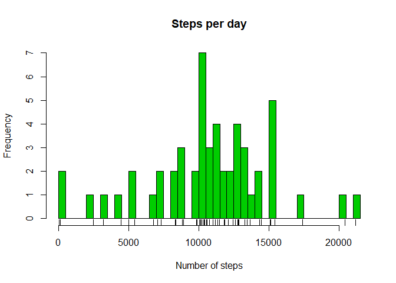
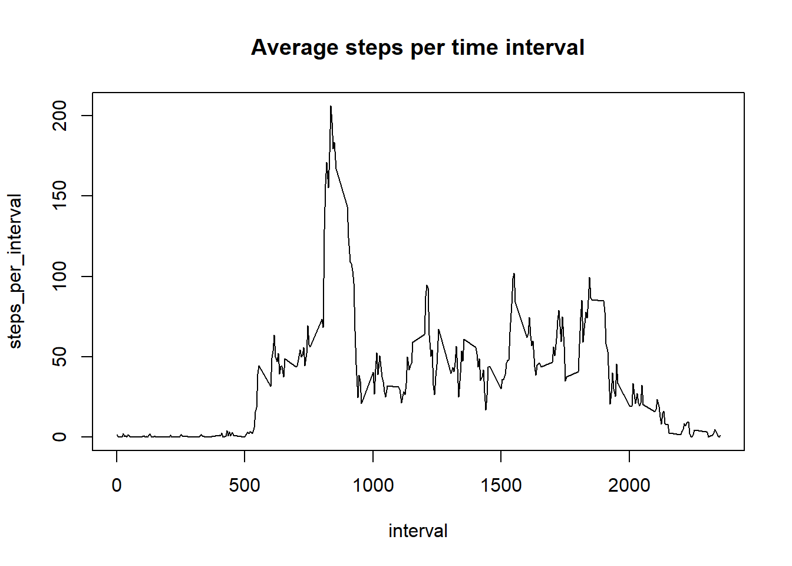
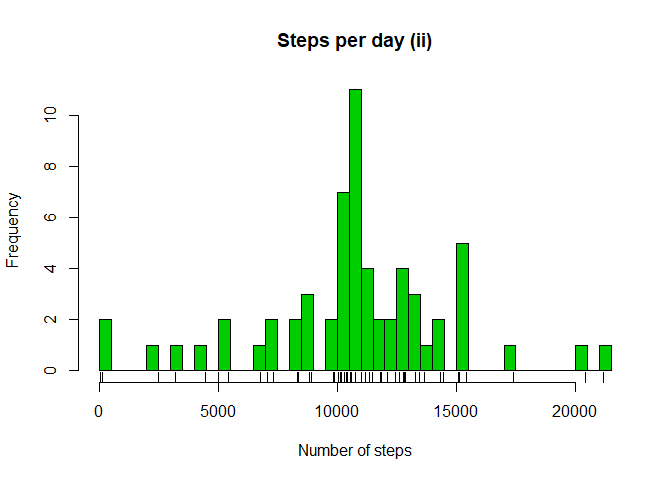

Reproducible Research Assignment
========================

## Initial setup and data fetch
Here, we're going to load the libraries we'll use within the code


```r
library(dplyr)
```

```
## 
## Attaching package: 'dplyr'
```

```
## The following objects are masked from 'package:stats':
## 
##     filter, lag
```

```
## The following objects are masked from 'package:base':
## 
##     intersect, setdiff, setequal, union
```

```r
library(lattice)
```

We set the locale to English to avoid inconsistencies  

```r
Sys.setlocale("LC_ALL","English")
```

```
## [1] "LC_COLLATE=English_United States.1252;LC_CTYPE=English_United States.1252;LC_MONETARY=English_United States.1252;LC_NUMERIC=C;LC_TIME=English_United States.1252"
```

We fetch the data from the source "activity.csv" file and convert the date column to be a date. 
This file must be in the current working directory

```r
rawdata<-read.csv("activity.csv")
rawdata$date <-as.Date(rawdata$date, format = "%Y-%m-%d")
```

## Question 1: what is mean total number of steps taken per day?  
#### 1. Calculate the total number of steps taken per day

```r
steps_per_day<-rawdata[complete.cases(rawdata),]%>%group_by(date)%>%summarise(total_steps=sum(steps,na.rm=TRUE))
```
#### 2. Make a histogram of the total number of steps taken each day  

```r
hist(steps_per_day$total_steps,main = "Steps per day",xlab = "Number of steps", ylab = "Frequency",col=3,breaks=50)
rug(steps_per_day$total_steps)
```

<!-- -->

#### 3. Calculate and report the mean and median of the total number of steps taken per day  
**Mean value for the number of steps taken per day**

```r
mean_steps_per_day<-mean(steps_per_day$total_steps)
print(mean_steps_per_day)
```

```
## [1] 10766.19
```
**Median value for the number of steps taken per day**

```r
median_steps_per_day<-median(steps_per_day$total_steps)
print(median_steps_per_day)
```

```
## [1] 10765
```

## Question 2: what is the average daily activity pattern?

#### 1. Time series plot (type = "l") of the 5-minute interval (x-axis) and the average number of steps taken, averaged across all days (y-axis)

We calculate the dataframe with intervals and average number of steps

```r
steps_per_interval<-rawdata[complete.cases(rawdata),]%>%group_by(interval)%>%summarise(steps_per_interval=mean(steps,na.rm=TRUE))
```
Plot using the base plotting system

```r
with(steps_per_interval,plot(interval, steps_per_interval,main="Average steps per time interval", type="l"))
```

<!-- -->

#### 2. Which 5-minute interval, on average across all the days in the dataset,contains the maximum number of steps?

```r
interval_max_steps<-steps_per_interval[which.max(steps_per_interval$steps_per_interval),]
print(interval_max_steps)
```

```
## # A tibble: 1 x 2
##   interval steps_per_interval
##      <int>              <dbl>
## 1      835               206.
```
   
Interval **835** is the one with the maximun average steps **(216.1698)**


## Question 3: Missing values
#### 1. Calculate and report the total number of missing values in the dataset (i.e. the total number of rows with NAs)

```r
na_rows<-sum(is.na(rawdata$steps))
percent_na_rows<-na_rows/sum(nrow(rawdata))
```
Number of NA rows

```r
print(na_rows)
```

```
## [1] 2304
```
Percentage of NA rows over total

```r
print(paste(round(100*percent_na_rows, 2), "%", sep=""))
```

```
## [1] "13.11%"
```
#### 2. Devise a strategy for filling in all of the missing values in the dataset. The strategy does not need to be sophisticated. For example, you could use the mean/median for that day, or the mean for that 5-minute interval, etc.

The strategy is:  
- 1.Make a copy of the original dataset  
- 2.Detect the rows with NA in the steps value (column 1)  
- 3.Look for the interval of the rwo in the average steps per interval data frame  
- 4.Replace the NA vale with the average steps per interval  

#### 3. Create a new dataset that is equal to the original dataset but with the missing data filled in.

Copy of the original dataset

```r
newrawdata<-rawdata
```
For all the rows in the dataset we check if the value for the number of steps is NA.
We look for the same interval across the average steps per interval dataframe
We replace the NA value with the average step per interval

```r
for(i in 1:nrow(newrawdata))
{
  if(is.na(newrawdata[i,1])==TRUE)
  {
    for(j in 1:nrow(steps_per_interval))
    {
      if(newrawdata[i,3]==steps_per_interval[j,1])
      {
        newrawdata[i, 1] <- steps_per_interval[j,2]
        break 
      }
    }
  }
}
```

#### 4. Histogram of the total number of steps taken each day and Calculate and report the mean and median total number of steps taken per day. Do these values differ from the estimates from the first part of the assignment? What is the impact of imputing missing data on the estimates of the total daily number of steps?

```r
steps_per_day2<-group_by(newrawdata,date)%>%summarise(total_steps=sum(steps,na.rm=TRUE))
hist(steps_per_day2$total_steps,main = "Steps per day (ii)",xlab = "Number of steps", ylab = "Frequency",col=3,breaks=50)
rug(steps_per_day2$total_steps)
```

<!-- -->

**Mean of steps per day**

```r
mean_steps_per_day2<-mean(steps_per_day2$total_steps)
print(mean_steps_per_day2)
```

```
## [1] 10766.19
```
**Median of steps per day**

```r
median_steps_per_day2<-median(steps_per_day2$total_steps)
print(median_steps_per_day2)
```

```
## [1] 10766.19
```

The impact of NAs is simply squeezing 1st and 3rd quantiles. Mean and meadian remain unchanged.


## Question 4: are there differences in activity patterns between weekdays and weekends?

#### 1. Create a new factor variable in the dataset with two levels – “weekday” and “weekend” indicating whether a given date is a weekday or weekend day

First we create a vector with the weekdays and we assign the values of the factor corresponding to its two levels

```r
weekdays<-c("Monday", "Tuesday","Wednesday","Thursday","Friday")
newrawdata$weekday<- factor((weekdays(newrawdata$date) %in% weekdays),
                    levels=c(FALSE, TRUE), labels=c('weekend', 'weekday'))
```
#### 2.Panel plot containing a time series plot type="l") of the 5-minute interval (x-axis) and the average number of steps taken, averaged across all weekday days or weekend days (y-axis).

```r
steps_per_interval2<-group_by(newrawdata,interval,weekday)%>%summarise(steps_per_interval2=mean(steps,na.rm=TRUE))
xyplot(steps_per_interval2~interval | weekday,data=steps_per_interval2,layout=c(1,2),type="l",ylab = "Number of steps",xlab="Interval")
```

<!-- -->

